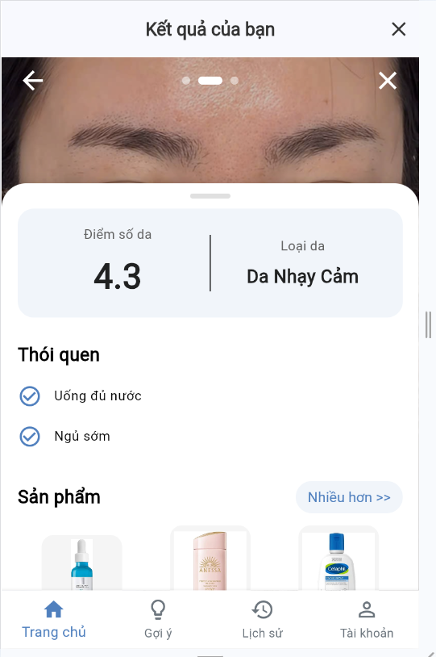
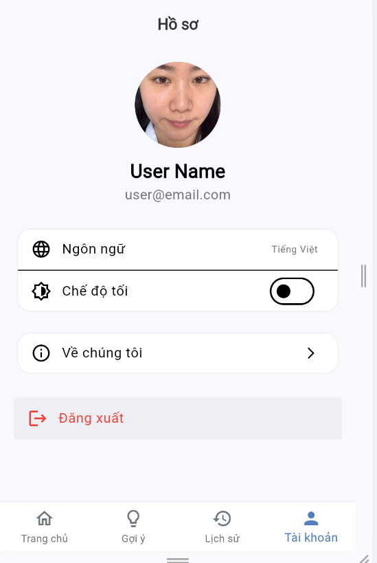
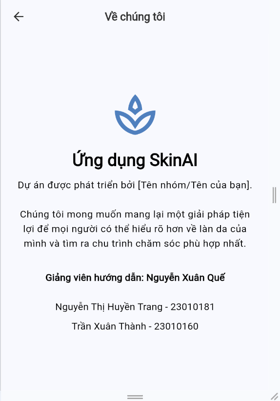
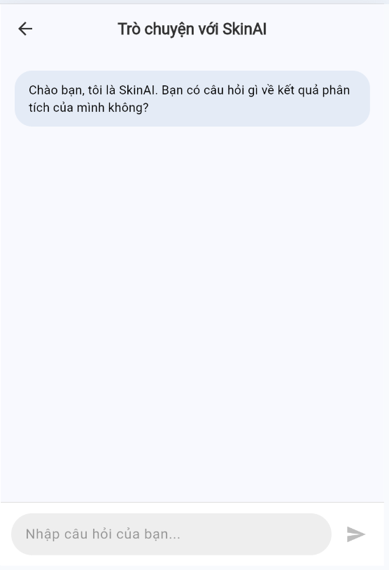
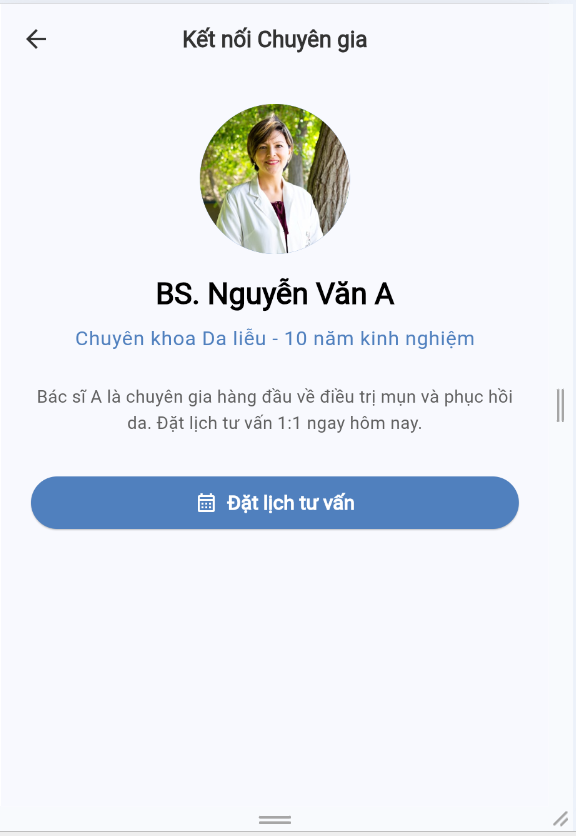

# SkinAI - Ứng dụng Phân tích Da bằng AI trên Flutter


**SkinAI** là một dự án ứng dụng di động đa nền tảng (Android, iOS, Web) được xây dựng bằng Flutter. Đây là đồ án Bài tập lớn cho môn học Lập trình cho thiết bị di động, tập trung vào việc xây dựng một giao diện người dùng (UI/UX) chuyên nghiệp, đáp ứng nhanh và có kiến trúc vững chắc.

Ứng dụng cho phép người dùng phân tích tình trạng da của mình thông qua một luồng 4 bước đơn giản, từ đó nhận được các gợi ý cá nhân hóa về chăm sóc da, sản phẩm và lối sống.

---
### Link demo : 
---
## 📸 Giao diện & Tính năng Nổi bật

Dự án đáp ứng đầy đủ các yêu cầu cao nhất về giao diện (chiếm 4/10 điểm của đề tài), bao gồm:

* **Thiết kế nhất quán:** Sử dụng hệ thống `Theme` (Sáng/Tối) và bảng màu (`AppColors`) tùy chỉnh cho toàn bộ ứng dụng.
* **Đa ngôn ngữ (i18n):** Hỗ trợ đầy đủ Tiếng Anh và Tiếng Việt, được quản lý bằng `flutter_gen` và các file `.arb`.
* **Tương thích màn hình:** Sử dụng các widget co giãn (responsive) như `PageView`, `ListView`, `GridView`.

| Màn hình Giới thiệu | Màn hình Tải ảnh | Màn hình Khảo sát | Màn hình Kết quả |
| :---: | :---: | :---: | :---: |
|  |  |  |  |
| **Màn hình Gợi ý (Tabs)** | **Màn hình Lịch sử** | **Màn hình Hồ sơ (Cá nhân)** | **Trang "Về chúng tôi"** |
|  |  |  |  |
| **Màn hình Trò chuyện** | **Màn hình Tư vấn chuyên gia** | 
|  |  |


### 🌟 Tính năng chi tiết:

* **Trang chủ "Thông minh":** Tự động hiển thị màn hình `IntroStep` (giới thiệu) cho người dùng mới và một `Dashboard` (bảng điều khiển) chuyên nghiệp cho người dùng cũ.
* **Giao diện Tải ảnh Nâng cao:** Sử dụng `PageView` làm nền, cho phép người dùng lướt (swipe) qua lại 3 ảnh (Trái, Chính diện, Phải) thay vì chỉ xem thumbnail.
* **Khảo sát "AI" (Mô phỏng):** Sử dụng hệ thống **tính điểm (scoring system)** để suy luận ra `Loại da` của người dùng dựa trên tổ hợp của **tất cả 5 câu trả lời** khảo sát.
* **Hiển thị Kết quả Chi tiết:**
    * Sử dụng `DraggableScrollableSheet` (tấm panel kéo) chuyên nghiệp.
    * Hiển thị **Điểm trung bình** (được tính toán tự động từ 6 chỉ số phụ) và **Loại da** (được suy luận từ khảo sát).
    * Hiển thị các "teaser" (mồi) cho các mục cải thiện, sản phẩm, "Chat với AI" và "Kết nối chuyên gia".
* **Điều hướng Thông minh:** Nút "Nhiều hơn >>" ở màn hình Kết quả có khả năng **ra lệnh cho ứng dụng chuyển sang tab Gợi ý VÀ tự động chọn tab con "Sản phẩm"**.
* **Lịch sử & Biểu đồ Tiến trình:**
    * Sử dụng `fl_chart` để vẽ **biểu đồ đường** trực quan hóa tiến trình điểm số theo thời gian.
    * Cho phép **xóa** các mục lịch sử (với hộp thoại xác nhận) và **xem lại chi tiết** (tái sử dụng `ResultsStep`).
* **Cài đặt Chuyên nghiệp:**
    * Người dùng có thể tự do chuyển đổi **Ngôn ngữ (Anh/Việt)**.
    * Người dùng có thể bật/tắt **Chế độ Sáng/Tối (Light/Dark Mode)**.
    * Các lựa chọn này được lưu lại bằng `shared_preferences`.
* **Thông tin Nhóm:** Màn hình "Về chúng tôi" (`AboutUsScreen`) hiển thị đầy đủ thông tin GVHD và sinh viên, đáp ứng yêu cầu đề tài.

---

## 🛠️ Kiến trúc & Công nghệ

Ứng dụng được xây dựng với kiến trúc hiện đại, tách biệt rõ ràng giữa giao diện (UI) và logic nghiệp vụ (Business Logic).

* **Framework:** Flutter 3.x / Dart 3.x
* **Quản lý Trạng thái:** **Riverpod**
    * `appStateProvider`: Quản lý trạng thái chung (bước hiện tại, kết quả cuối cùng).
    * `analysisFlowProvider`: Quản lý dữ liệu của một phiên phân tích (ảnh, khảo sát) và chứa logic "AI" suy luận loại da.
    * `localeProvider` & `themeProvider`: Quản lý cài đặt của người dùng.
    * `navigationProvider`: Quản lý điều hướng tab chéo.
* **Model Dữ liệu:** `json_serializable` & `build_runner` để tự động tạo code `fromJson/toJson` an toàn.
* **Đa ngôn ngữ (i18n):** `flutter_gen` (`l10n.yaml` và các file `.arb`).
* **Lưu trữ Cục bộ:** `shared_preferences` (Lưu cài đặt Ngôn ngữ & Theme).
* **Giao diện:** `fl_chart` (Biểu đồ), `lottie` (Animation), `image_picker`.

---

## 🚀 Hướng dẫn Cài đặt & Chạy

1.  **Clone Repository:**
    ```bash
    git clone [https://github.com/htrsng/btl_tbdd_NO5_trang-thanh.git]
    cd app
    ```

2.  **Cài đặt Dependencies:**
    ```bash
    flutter pub get
    ```

3.  **Generate Code (Rất quan trọng):**
    Chạy cả hai lệnh sau để tạo các file `l10n` và `.g.dart` cần thiết.
    ```bash
    # 1. Tạo file ngôn ngữ
    flutter gen-l10n
    
    # 2. Tạo file model (.g.dart)
    dart run build_runner build --delete-conflicting-outputs
    ```

4.  **Chạy Ứng dụng:**
    ```bash
    # Chạy trên web (để debug nhanh)
    flutter run -d chrome
    
    # Hoặc chạy trên thiết bị/máy ảo
    flutter run
    ```

---

## 📂 Cấu trúc Thư mục Dự án
```
app/
├── assets/
│   ├── animations/        # Chứa file Lottie
│   └── images/            # Chứa ảnh sản phẩm
│
├── lib/
│   ├── data/              # Chứa dữ liệu tĩnh (câu hỏi khảo sát)
│   ├── l10n/              # Chứa các file ngôn ngữ .arb
│   ├── models/            # Định nghĩa các đối tượng (SkinAnalysis)
│   ├── providers/         # Chứa các provider của Riverpod
│   ├── screens/           # Chứa các màn hình chính và các bước (steps)
│   │   ├── steps/         
│   │   ├── fake_chat_screen.dart
│   │   ├── fake_expert_screen.dart
│   │   ├── about_us_screen.dart
│   │   ├── home_screen.dart
│   │   ├── history_screen.dart
│   │   ├── suggestions_screen.dart
│   │   ├── profile_screen.dart
│   │   └── main_screen.dart
│   ├── utils/             # Chứa file màu sắc (app_colors) và theme (app_theme)
│   ├── widgets/           # Chứa các widget tái sử dụng (bottom_tab_bar, panel)
│   └── main.dart          # Điểm khởi đầu, cấu hình MaterialApp
│
├── l10n.yaml              # Cấu hình cho flutter_gen
└── pubspec.yaml           # Quản lý thư viện và assets

```
---

## 🤝 Đóng góp & Phát triển

* **Báo lỗi (Issues):** Vui lòng mở một issue mới trên GitHub nếu bạn phát hiện bug hoặc có ý tưởng cho tính năng mới.
* **Pull Requests (PR):** Fork project -> Tạo branch mới (`git checkout -b feature/AmazingFeature`) -> Commit thay đổi (`git commit -m 'Add some AmazingFeature'`) -> Push lên branch (`git push origin feature/AmazingFeature`) -> Mở một Pull Request.

### Hướng phát triển trong tương lai:
* Tích hợp backend thật (Firebase) để lưu trữ kết quả.
* Sử dụng ML Kit (TensorFlow Lite) để thực hiện phân tích hình ảnh thực sự.
* Thêm thông báo đẩy (Push Notifications) để nhắc nhở chu trình chăm sóc da.
* Gợi Ý Sản Phẩm Thông Minh (Affiliate Integration): Kết nối API Shopee/Lazada để hiển thị sản phẩm thực tế (với giá, review, link mua), tích hợp affiliate (commission). Sử dụng collaborative filtering (scikit-learn mock) để gợi ý dựa lịch sử user tương tự.
* Chat Với AI (Conversational AI): Tích hợp Gemini/ChatGPT API để chat hỏi đáp (e.g., "Da tôi dầu, dùng serum nào?"), với context từ analysis (loại da, vấn đề).
* Kết Nối Chuyên Gia (Telemedicine): Hợp tác với bác sĩ da liễu (Zoom API hoặc chat in-app), gửi kết quả phân tích tự động để tư vấn trực tuyến (premium feature).
* AR Try-On (Augmented Reality): Sử dụng ARKit/ARCore để thử sản phẩm ảo trên ảnh da, hoặc overlay 3D guide chụp ảnh chính xác hơn.
* Community & Social: Thêm forum in-app (Firebase Realtime DB) để chia sẻ tips, rating sản phẩm, hoặc challenge "30 ngày cải thiện da".

---

## 📬 Liên hệ

* **Email:** 23010181@st.phenikaa-uni.edu.vn & 23010160@st.phenikaa-uni.edu.vn
* **GitHub:** [github.com/skinai-team](https://github.com/htrsng/btl_tbdd_NO5_trang-thanh)